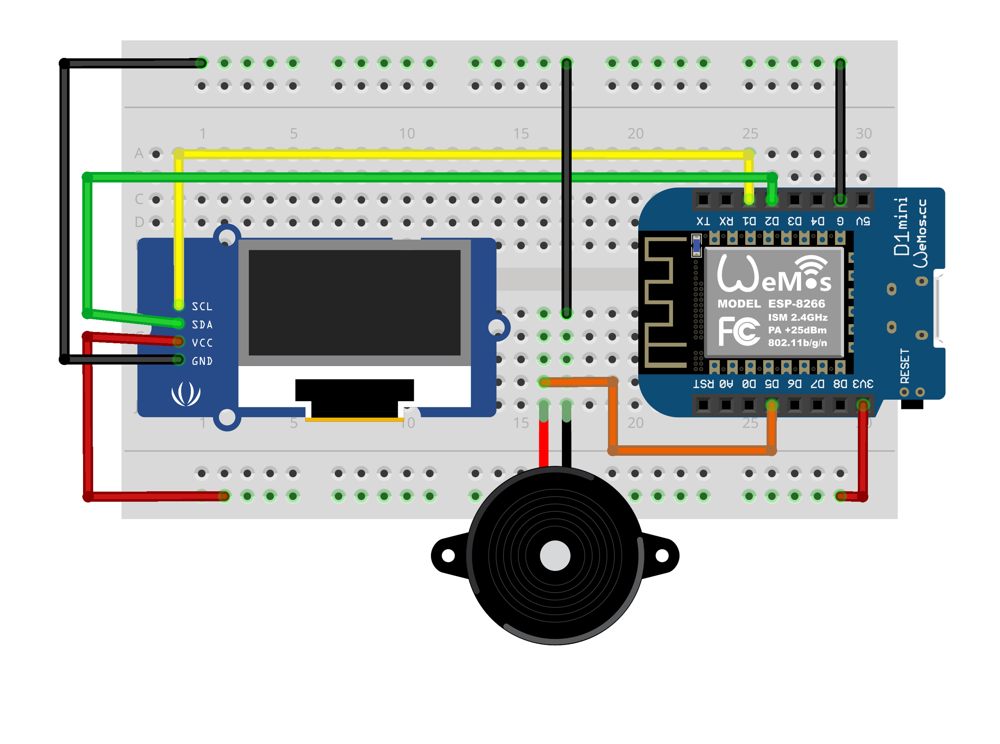
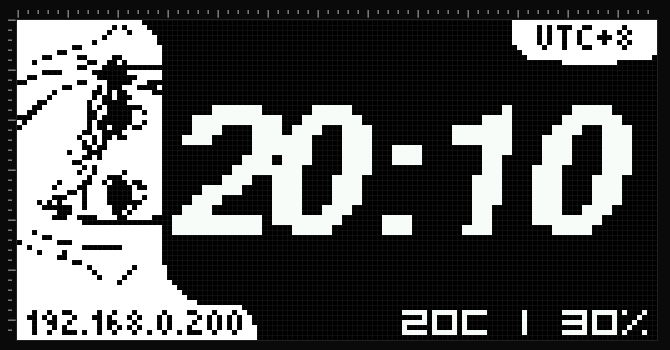
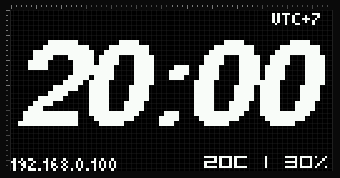
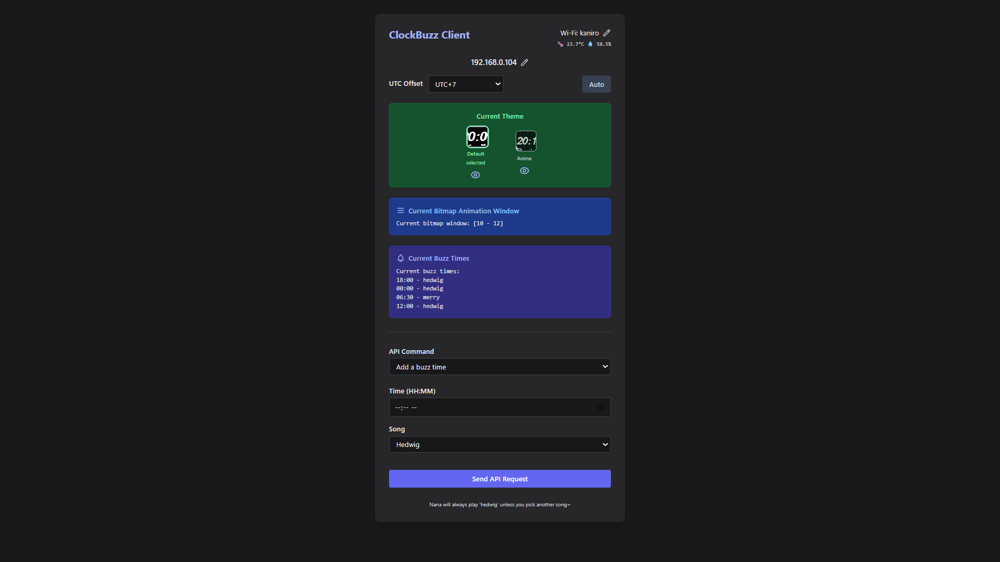

# BuzzClock ESP8266

**NanaClock** is a digital alarm clock project based on ESP8266, featuring Wi-Fi setup, OLED animations (with anime and default themes!), Web API, alarm music via buzzer, and now supports **DHT22 temperature & humidity sensor**! Easily configured through a web browser, it displays animated bitmaps and real-time environment data at specific times.

<p align="center">
  
</p>

**i forgot to updated the images with the dht22..*

> [!NOTE]
> The OLED shown in the image is a different model, but the pinout is the same.


## ✨ Main Features

- **WiFi Manager:** Setup WiFi via portal if not yet connected.
- **Web API:** Control alarm, time, WiFi, & now read DHT22 data via HTTP endpoints.
- **NTP Client:** Automatic time sync from the internet, supports timezone (UTC offset).
- **Buzzer Music:** Plays "Hedwig's Theme" & "We Wish You a Merry Christmas".
- **Bitmap Animation:** Display animation on OLED during specific minute ranges.
- **OLED Display:** Shows digital clock, IP address, and environment data.
- **Themed Display:** Switch between default and anime-themed clock UI!
- **Persistent Configuration:** All settings are saved in `LittleFS` (internal flash).
- **DHT22 Support:** Shows real-time temperature & humidity on the OLED and via API.

---

## 🛠️ Supported Hardware

- **ESP8266 board:** NodeMCU/WeMos D1 Mini/etc.
- **OLED SSD1306 128x64 I2C**
- **Active buzzer**
- **DHT22 (AM2302) sensor** (for temperature & humidity)
- **WiFi connection**


## 📦 Required Arduino Libraries

Make sure to install the following libraries:

- [ESP8266 Core](https://github.com/esp8266/Arduino)
- [WiFiManager](https://github.com/tzapu/WiFiManager)
- [ArduinoJson](https://github.com/bblanchon/ArduinoJson)
- [Adafruit SSD1306](https://github.com/adafruit/Adafruit_SSD1306)
- [Adafruit GFX](https://github.com/adafruit/Adafruit-GFX-Library)
- [ESP8266WebServer](https://arduino-esp8266.readthedocs.io/en/latest/esp8266webserver.html)
- [LittleFS](https://arduino-esp8266.readthedocs.io/en/latest/filesystem.html)
- [DHT sensor library](https://github.com/adafruit/DHT-sensor-library)


## ⚡ Wiring

### OLED ↔️ ESP8266

| OLED | ESP8266 |
| ---- | ------- |
| SDA  | D2      |
| SCL  | D1      |
| VCC  | 3V3     |
| GND  | GND     |

### Buzzer ↔️ ESP8266

| Buzzer | ESP8266 |
| ------ | ------- |
| VCC    | D5      |
| GND    | GND     |

### DHT22 ↔️ ESP8266

| DHT22 | ESP8266 |
| ----- | ------- |
| VCC   | 3V3     |
| DATA  | D6      |
| GND   | GND     |

> [!NOTE]
> A 10k resistor between VCC and DATA is recommended for the DHT22, but in some cases it working perfectly fine without it.

## 🖼️ OLED Bitmap, Themed UI & Client UI

**Example of bitmap image (its black & white) for the OLED:**

<p align="center">
  
</p>

### Themed Display

You can now switch between the **default** and **anime-themed** digital clock UI!

| Theme Name      | Preview                                           | API Command             |
| --------------- | ------------------------------------------------- | ----------------------- |
| **Anime Theme** |    | `/displaytheme?theme=1` |
| **Default**     |  | `/displaytheme?theme=0` |

- The anime theme gives your clock a cute, unique look, perfect for fans.
- Change the theme via the web UI or the API.

**Web client interface screenshot:**

<p align="center">
  
</p>


## 🚀 How to Use

### 1. Flash firmware to ESP8266

Upload the source code to your board using Arduino IDE.

### 2. Setup WiFi

- On first boot, NanaClock will create a WiFi AP: `NanaClock Setup`.
- Connect your phone/laptop to this AP, then open `192.168.4.1` in your browser.
- Enter your home WiFi SSID & password, and the UTC offset (e.g., 7 for GMT+7/WIB).

### 3. API Endpoints

Once connected, access the ESP8266 IP address from your browser to configure:

```
http://<esp-ip>/
```

| Endpoint                            | Function                               |
| ----------------------------------- | -------------------------------------- |
| `/settime?utc=7`                    | Set UTC offset                         |
| `/gettime`                          | Get current UTC offset                 |
| `/buzztime?add=06:30[&song=hedwig]` | Add 6:30 alarm, optional song          |
| `/buzztime?remove=06:30`            | Remove alarm                           |
| `/buzztime?set=06:30&song=merry`    | Change alarm song for 6:30             |
| `/buzztime`                         | List active alarms                     |
| `/setwifi?ssid=xxx&pass=xxx`        | Change WiFi, takes effect after reboot |
| `/getwifi`                          | Show current WiFi SSID                 |
| `/bitmapwindow?start=20&end=30`     | Set bitmap animation minute window     |
| `/bitmapwindow`                     | Show bitmap window settings            |
| `/ipaddress`                        | Get ESP IP address                     |
| `/getdht`                           | Get current temperature & humidity     |
| `/displaytheme?theme=1`             | Switch OLED display to anime theme     |
| `/displaytheme?theme=0`             | Switch OLED display to default theme   |
| `/displaytheme`                     | Show current theme                     |

---

## 🎨 Customization

- **Bitmap Animation:** Modify the `epd_bitmap_allArray` in the code for your own bitmap images (`PROGMEM`), you can use this [link](https://javl.github.io/image2cpp/) to convert image to bitmap.
- **Alarm Songs:** Add new songs to the `buzzNow` function.
- **Number of Alarms:** To support more than 7 alarms, change `MAX_BUZZ` in the code.
  ```
  #define MAX_BUZZ 7 //<-- change here
  ```
- **Theme:** Add more themes by expanding the `drawThemedClock()` function.

---

## 🌡️ DHT22 Sensor

- **OLED display will show temperature and humidity** in real time.
- Access sensor data through `/getdht` endpoint for remote monitoring.
- If sensor is missing or not responding, it will show "N/A" on the display and API.

---

## 🖼️ When Does the Bitmap Animation Show?

The OLED bitmap animation is displayed **only during the minute range you set** using the `/bitmapwindow` API endpoint.
For example, if you set:

```
/bitmapwindow?start=20&end=30
```

the animation will show **every hour, from minute 20 to 30** (e.g., 10:20–10:30, 11:20–11:30, etc.).
At all other times, the OLED shows the normal clock display.

You can configure this from the UI browser Interface or directly from your browser:

```
http://<esp-ip>/bitmapwindow?start=XX&end=YY
```

Replace `XX` and `YY` with the minute values you want.

> **Tip:**
> If you want your mascot or animation to appear at a special moment (like every :00 to :05 for a "hello" at the top of each hour), just set `start=0&end=5`.
> The rest of the time, Nana will just show you the clock—so it’s up to you, when you want to make things cute or dramatic! 🐾


## ℹ️ Notes

> [!IMPORTANT]
> If WiFi connection fails, the device will automatically return to setup mode.

> [!IMPORTANT]
> Temporary API server: `http://localhost:2000/nanaclock.php` (can be changed).

> [!IMPORTANT]
> The code for sending IP automaticly to the server only works if we served the server on plain HTTP and have no TLS (somehow i cannot figure it out with HTTPS😭).

> [!IMPORTANT]
> OLED in schematic is for illustration.


## 🐾 Credits

- **Arduino Songs** [by robsoncouto](https://github.com/robsoncouto/arduino-songs)

## 📄 License

MIT License — feel free to modify, use, and share.

